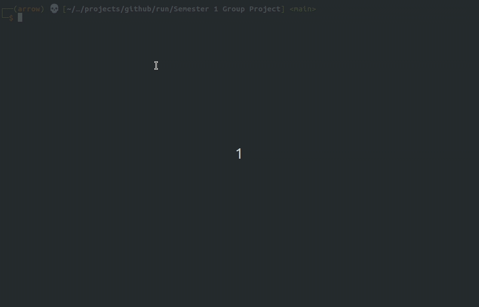

## Run

A simple text based adventure game written in Python as part of our introductory programming course UE20CS101 (Python for Computational Problem Solving).

Try it out!

```
git clone https://github.com/a-r-r-o-w/run
cd Semester\ 1\ Group\ Project/
python3 main.py
```

The program should auto-install dependencies but if an error occurs, try:

```
python3 -m pip install playsound bs4 lxml
```



### Team

- Aryan V S (PES1UG20CS083)
- Aryansh Bhargavan (PES1UG20CS084)
- Chetan Gurram (PES1UG20CS112)
